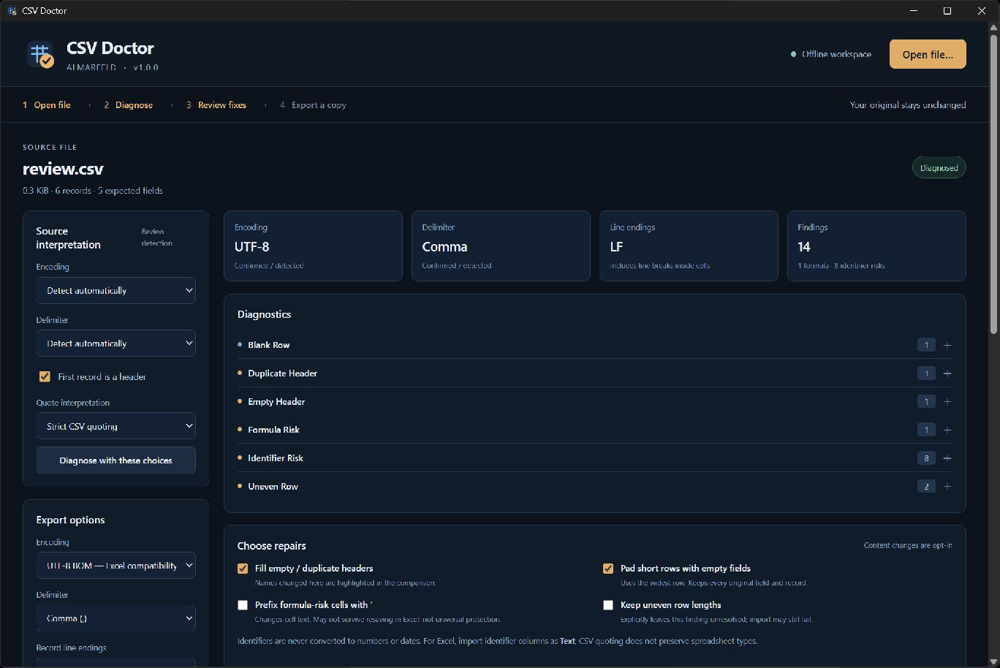

# CSV Doctor

**Diagnose. Review. Export a copy.**

An offline Windows utility from ALMARFELD for CSV, TSV and delimited TXT files. Find structural problems and spreadsheet-import risks before opening data in Excel or another application.

**CSV Doctor v1.0.0**



## What it does

- Detects comma, semicolon, tab and pipe delimiters, with explicit choices when detection is ambiguous.
- Reads valid UTF-8, UTF-8 BOM, UTF-16 LE/BE and Windows-1252. UTF-16 without a BOM and Windows-1252 are suggestions requiring explicit confirmation.
- Reports line-ending styles, uneven field counts, blank records, empty/duplicate headers, malformed quoting, formula-risk prefixes and leading-zero/long numeric identifiers.
- Shows source diagnostics and a table preview, then highlights changed cells in a before/after comparison.
- Offers opt-in header names, padding of short records and apostrophe prefixes for formula-risk cells. Uneven row lengths can instead be explicitly preserved, with the finding left unresolved.
- Exports UTF-8 or UTF-8 BOM using any supported delimiter and CRLF/LF record separators.
- Creates an adjacent `.report.json` with source/output SHA-256, format choices, findings, changes and remaining risks. Reports include the source basename and counts, not cell contents or full source paths.

## Safety guarantees

The original is never overwritten. Existing output files and existing reports are refused. Opening, diagnosing and reviewing do not write to the source. Canceling the export dialog writes nothing.

Cell text stays text: no numeric/date conversion, no trimming, and no silent deletion of records or columns. Leading zeros, long integers and Unicode are retained. CRLF/LF/CR **inside quoted cells** stay unchanged even when record separators change. Empty records are serialized as quoted empty fields so they survive reopening; this may change physical blank-line representation while preserving record count and cell text.

Content changes are off by default and named in the review. Padding adds explicit empty fields to the widest record; it never discards longer records. Header repair retains non-duplicate names and avoids collisions with existing names.

Failed strict parsing blocks export. Literal-quote mode is an explicit alternative interpretation, not automatic recovery: quote characters are kept as text and embedded line breaks become separate records. Review this choice carefully; the application cannot know the author's intended structure. Source delimiter/encoding overrides are also explicit interpretations, not proof of correctness.

The app never evaluates formulas, opens embedded links, uploads data, phones home, uses telemetry, creates accounts or downloads dependencies automatically. Error dialogs may show local paths supplied by Windows. No recent-file list or file contents are persisted by the app.

## Excel limitations

CSV has no cell types. Even correctly quoted identifiers can be converted to numbers or dates by Excel. Use **Data → From Text/CSV** and import identifier columns as **Text**. UTF-8 BOM helps Excel recognize the encoding; it does not protect identifiers or formulas.

Formula-risk detection covers `=`, `+`, `-`, `@`, leading whitespace/control characters and their full-width variants. It is intentionally conservative: ordinary negative numbers can be flagged. Optional apostrophe prefixing **changes cell text**, varies across spreadsheet software and may not survive resaving. It is not a universal CSV-injection defense or malware scan. Import untrusted data cautiously.

References: [Microsoft: UTF-8 CSV import](https://support.microsoft.com/en-us/excel/opening-csv-utf-8-files-correctly-in-excel), [OWASP: CSV injection](https://community.owasp.org/attacks/CSV_Injection).

## Run CSV Doctor

Windows 10/11 x64. Extract the entire portable ZIP into a folder and run **CSVDoctor.exe**. The separate **Microsoft Edge WebView2 Runtime** is required: [official Microsoft download](https://developer.microsoft.com/microsoft-edge/webview2/). Nothing installs automatically. The binaries are not Authenticode signed; Windows may show a reputation warning. Do not disable Windows security.

Open one `.csv`, `.tsv` or `.txt`, or drop it onto the window. Diagnose the source, choose only the needed changes, review the comparison, then export a new copy and report. The first record is treated as a header by default; turn that option off and diagnose again for headerless data.

## Limits

- 16 MiB input; 100,000 records; 256 fields per record; 1,000,000 cells total. Limits block export rather than truncate the saved data.
- Preview: first 100 records, first 2,000 bytes per cell, first 200 finding locations. Export uses the full parsed data. Detection compares up to the first 200 nonblank records.
- This is an in-memory, single-file tool, not a streaming editor or a batch converter.
- Strict comma/semicolon/tab/pipe CSV uses double-quote escaping. Custom delimiters, backslash escaping, UTF-32, arbitrary legacy encodings, binary files and automatic quote reconstruction are not supported.
- No spreadsheet rendering, formula calculation, schema inference, date conversion or automatic identifier protection.
- File output and report are separate writes. If the CSV copy succeeds but the report cannot be saved, the app explicitly reports a partial export. Existing files are never replaced.
- Export with unresolved findings is possible only where explicitly allowed; the report lists remaining findings. A saved copy is not a claim that all import/security issues were fixed.

## Build and test

Go version is specified in `go.mod`; Node 22 is specified in `.node-version`. Wails CLI must match the dependency exactly.

```powershell
cd frontend
npm ci
npm test
npm run build
cd ..
go vet ./...
go test ./...
go install github.com/wailsapp/wails/v2/cmd/wails@v2.16.0
wails build -clean -s -webview2 browser
./scripts/package.ps1
```

All fixtures in `testdata/` are synthetic. Tests cover encodings, delimiters, malformed and multiline quoting, uneven rows, header repair, identifier preservation, optional formula prefixes, round trips, safe output creation, bounded previews and stale-review rejection. Frontend tests check escaping and change highlighting. Windows CI builds the same production executable; it does not create tags or releases.

MIT license. [Source](https://github.com/AlinTibi/CSVDoctor) · [Support](https://almarfeld.com/support/) · [Security](https://almarfeld.com/security/)
